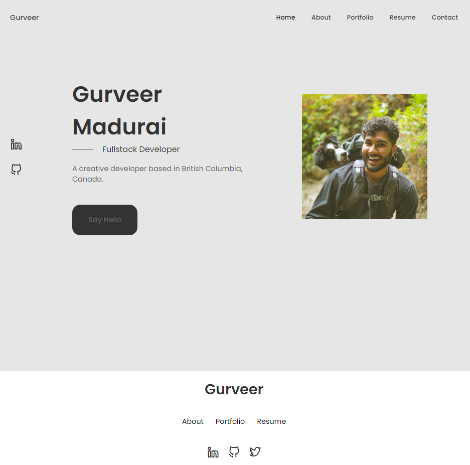

# React Portfolio

## Description

This is a portfolio showcasing a few of my projects, resume, an about me section, and a contact method.

## Table of Contents

1. [Usage](#usage)
2. [License](#license)
3. [Demo](#demo)
4. [Questions](#questions)

## Usage

Visit the deployed portfolio https://gurverm.github.io/react-portfolio/ or clone the repo and run `npm install` and `npm start` to run locally.

## Demo

Below is a screenshot of the deployed portfolios home page.

## License

This project is licensed under mit
https://opensource.org/licenses/MIT

## Questions

If you have any additional questions regarding this project please contact me at maduraigurveer@gmail.com.
You can view more of my work at https://github.com/gurverm

